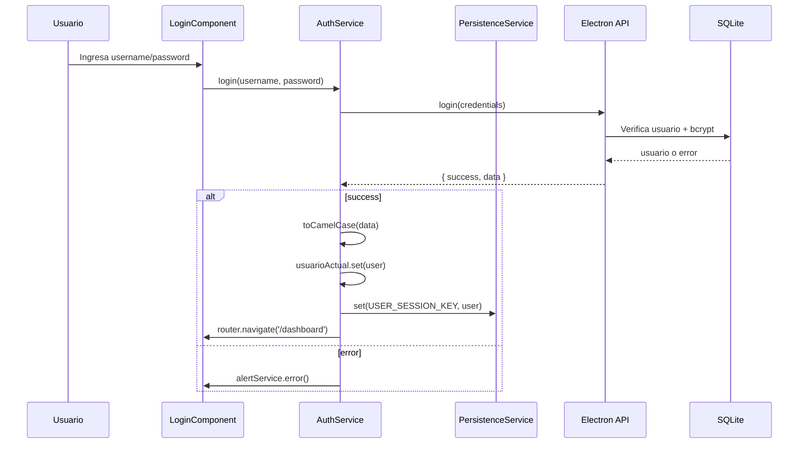
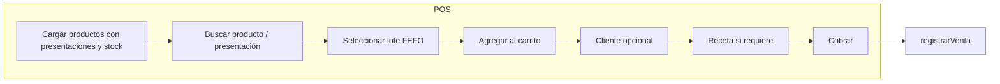
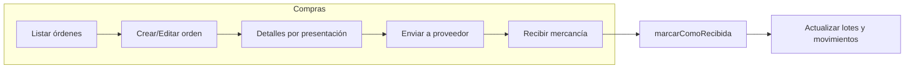

# Análisis del flujo de trabajo – Mi Farmacia

Este documento describe cómo fluye el trabajo en la aplicación: autenticación, ventas, compras, inventario, productos y configuración, y cómo se relacionan los módulos con la base de datos y los roles.

---

## 1. Flujo de autenticación

- **Entrada:** `/login` (público). Si ya hay sesión persistida, `AuthService` la restaura en `constructor` desde `PersistenceService`.
- **Login:** `AuthService.login()` llama a `window.electronAPI.login()`. Electron valida usuario en BD y compara contraseña con bcrypt; devuelve el usuario (sin password) o error.
- **Post-login:** Se guarda el usuario en señal `usuarioActual` y en persistencia; redirección a `/dashboard`.
- **Protección de rutas:** `authGuard` comprueba `estaAutenticado()`; si no, redirige a `/login` con `returnUrl`. `roleGuard(roles)` comprueba que el usuario tenga uno de los roles permitidos; si no, mensaje de advertencia y redirección a `/dashboard`.
- **Logout:** Limpia señal y persistencia y redirige a `/login`.

---

## 2. Flujo de ventas

### 2.1 Punto de venta (POS)

- **Requisito:** Usuario autenticado. Opcionalmente se exige **caja abierta** (POS muestra modal de apertura si no hay sesión activa).
- **Datos:** `ProductosService.cargarProductos()` trae productos activos con presentaciones y `stock_total` / `proximo_vencimiento` por presentación. En POS solo se muestran presentaciones con `stockTotal > 0`.
- **Selección:** El usuario elige producto/presentación; `VentasService.obtenerLotesDisponibles(presentacionId)` devuelve lotes con stock y no vencidos ordenados por **FEFO** (fecha de vencimiento ascendente).
- **Carrito:** Items con producto, presentación, lote, cantidad, precio unitario y subtotal. Se calculan subtotales por tarifa IVA (0%, 15%) y total.
- **Receta:** Si el carrito incluye productos que requieren receta o son controlados, se puede capturar datos de receta (médico, número, etc.) y se guarda en `recetas` al registrar la venta.
- **Registro:** `VentasService.registrarVenta(venta, receta?)`:
  1. Genera clave de acceso SRI (SriService).
  2. Inserta cabecera en `ventas` (cliente, totales, metodo_pago, clave_acceso, estado_sri 'pendiente', cajero_id, sesion_caja_id).
  3. Si hay receta, inserta en `recetas`.
  4. Por cada detalle: inserta en `ventas_detalles`, actualiza `lotes.stock_actual` restando cantidad, e inserta en `movimientos_stock` tipo `salida_venta` con referencia `V-{ventaId}`.

### 2.2 Control de caja

- **Apertura:** `CajaService.abrirCaja(montoInicial)` inserta en `cajas_sesiones` (usuario_id, monto_inicial, estado 'abierta'). Al iniciar la app, `verificarSesionActiva()` busca la última sesión abierta del usuario.
- **Ventas:** Las ventas del POS se asocian a `sesion_caja_id` si hay caja abierta.
- **Cierre:** `CajaService.cerrarCaja(params)` calcula monto esperado en efectivo (monto inicial + ventas en efectivo de la sesión), actualiza la sesión con montos finales y estado 'cerrada' y limpia `sesionActiva`.

### 2.3 Historial de ventas y reporte ARCSA

- **Historial:** `VentasService.cargarVentas()` lista ventas con nombre de cliente; la vista muestra tabla ordenada por fecha.
- **Reporte ARCSA:** `VentasService.obtenerRecetasARCSA({ inicio, fin })` devuelve recetas en el rango de fechas con datos del cliente y productos controlados/requieren receta de cada venta, para cumplimiento regulatorio.

---

## 3. Flujo de compras

- **Roles:** Acceso con `roleGuard` para Administrador y Farmaceutico.
- **Listado:** `ComprasService.cargarOrdenes()` obtiene órdenes con nombre de proveedor; estados: borrador, pendiente, aprobada, recibida, cancelada.
- **Crear orden:** `ComprasService.crear(orden)` inserta en `ordenes_compra` (proveedor, fecha, estado, totales, creado_por) y en `ordenes_compra_detalles` (presentacion_id, cantidad en cajas, precio_unitario por caja, lote/fecha_vencimiento opcionales).
- **Recepción:** `ComprasService.marcarComoRecibida(id, detallesActualizados, nuevoTotal?)`:
  1. Actualiza detalles con cantidades, precios, lote y fecha de vencimiento reales.
  2. Por cada detalle con lote y vencimiento: obtiene `unidades_por_caja` de la presentación, calcula unidades base y precio unitario.
  3. UPSERT de lote: si existe lote con mismo `presentacion_id` y `lote`, suma al `stock_actual`; si no, inserta nuevo lote con fecha_ingreso.
  4. Inserta en `movimientos_stock` tipo `entrada_compra` con referencia `OC-{id}`.
  5. Cambia estado de la orden a `recibida`.

---

## 4. Flujo de inventario

### 4.1 Ajustes de stock

- **Roles:** Administrador, Almacen, Farmaceutico.
- **Pantalla:** Ajustes de Stock (`/inventario/ajustes`). Búsqueda de lotes vía `InventarioService.buscarLotes(termino)` (por producto, presentación o número de lote).
- **Acción:** Usuario elige lote, tipo de ajuste (positivo/negativo), cantidad y motivo. `InventarioService.ajustarStock(loteId, cantidad, tipo, motivo)`:
  1. Comprueba que el lote existe y que en ajuste negativo la cantidad no supere el stock actual.
  2. Actualiza `lotes.stock_actual`.
  3. Inserta en `movimientos_stock` (tipo `ajuste_positivo` o `ajuste_negativo`, cantidad +/-).
- **Auditoría:** En la misma pantalla se puede ver el historial de movimientos del lote con `obtenerMovimientosLote(loteId)`.

### 4.2 Gestión de vencimientos

- **Pantalla:** Vencimientos (`/inventario/vencimientos`). Dos listas: **próximos a vencer** (días configurables) y **vencidos** con stock > 0.
- **Próximos:** `InventarioService.obtenerProductosProximosAVencer(dias)` — lotes con stock y vencimiento entre hoy y hoy+días.
- **Vencidos:** `InventarioService.obtenerProductosVencidos()` — lotes con stock y fecha_vencimiento &lt; hoy.
- **Acciones por lote:**
  - **Marcar como vencido:** `marcarVencido(loteId, motivo)` — pone `stock_actual = 0` y registra movimiento tipo `vencimiento`.
  - **Devolver al proveedor:** `devolverAlProveedor(loteId, cantidad?, motivo, ordenCompraId?)` — reduce stock y registra movimiento tipo `devolucion`. Opcionalmente se obtiene el proveedor con `obtenerProveedorDelLote(loteId)` (a partir del primer movimiento `entrada_compra`) y se puede generar plantilla de correo con `generarPlantillaCorreoDevolucion()`.

---

## 5. Flujo de productos (catálogo)

- **Estructura:** Producto (catálogo maestro) → Presentaciones (empaques/precios) → Lotes (inventario físico por lote y vencimiento).
- **Listado:** `ProductosService.cargarProductos()` carga productos activos con categoría, laboratorio y presentaciones; para cada presentación se calcula `stock_total` (suma de lotes) y `proximo_vencimiento` (MIN fecha_vencimiento de lotes con stock).
- **Lotes y kardex:** Desde el detalle de producto se puede ver la lista de lotes por presentación y el historial de movimientos (kardex) vía `ProductosService.obtenerLotes()` / `obtenerMovimientosProducto()`.
- **Alertas en dashboard:** El dashboard usa consultas de stock bajo y próximos a vencer (equivalentes a las del módulo inventario) para mostrar resúmenes.

---

## 6. Flujo de configuración

- **Roles:** Solo Administrador.
- **SRI (Factura electrónica):** Pantalla de configuración con RUC, establecimiento, punto de emisión, ambiente, firma P12, etc. Se persiste en `sri_config` y se usa en `SriService` para generar claves y (en fases futuras) XML y envío al SRI.
- **Usuarios:** CRUD de usuarios (nombre, username, password hasheado con bcrypt en Electron, rol, estado). Los permisos de la app se basan en el rol (authGuard + roleGuard).

---

## 7. Resumen de integración entre módulos

| Origen        | Acción              | Destino / Efecto                                      |
|---------------|---------------------|--------------------------------------------------------|
| Compras       | Recibir orden       | Crea/actualiza lotes, movimientos `entrada_compra`   |
| Ventas (POS)  | Registrar venta     | Descuenta lotes, movimientos `salida_venta`            |
| Inventario    | Ajuste              | Actualiza lote, movimientos `ajuste_positivo/negativo` |
| Inventario    | Marcar vencido      | Stock lote = 0, movimiento `vencimiento`              |
| Inventario    | Devolución          | Reduce lote, movimiento `devolucion`                  |
| Caja          | Apertura/cierre     | Sesión asociada a ventas del cajero                   |
| Auth          | Login               | Sesión y rol determinan rutas y menú (sidebar)       |

Todos los movimientos de stock quedan registrados en `movimientos_stock` con tipo, lote_id, cantidad (positiva entrada, negativa salida), documento_referencia, observaciones y usuario_id, lo que permite trazabilidad y kardex completo.
