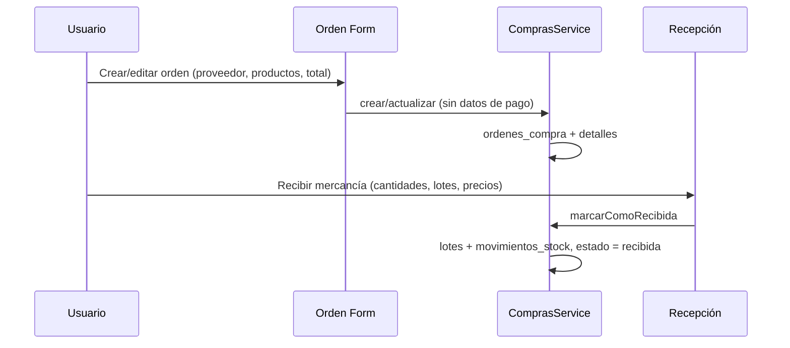

# Plan: Mejor gestión del módulo de Compras (contado / crédito y formas de pago)

## 1. Análisis del estado actual

### 1.1 Esquema actual

- **Tabla `ordenes_compra`** ([electron.js](electron.js) líneas 125-143):  
  `proveedor_id`, `fecha_emision`, `fecha_requerida`, `estado`, `subtotal`, `descuento_monto`, `impuesto_total`, `total`, `moneda`, `numero_factura`, `fecha_factura`, `creado_por`, `aprobado_por`, `observaciones`.

- **No existe**:
  - Tipo de compra (contado vs crédito).
  - Forma de pago (efectivo, transferencia, tarjeta).
  - Registro de pagos ni saldo pendiente.

### 1.2 Flujo actual

- La recepción solo actualiza inventario y totales; **no se registra ni pago ni forma de pago**.

### 1.3 Comparación con Ventas

En ventas ([pos.component.ts](src/app/features/ventas/components/pos/pos.component.ts), [ventas.service.ts](src/app/features/ventas/services/ventas.service.ts)):

- Cada venta tiene `metodo_pago`: efectivo, tarjeta, transferencia (y opcional referencia).
- Caja agrupa por `metodo_pago` para arqueo.

En compras no hay equivalente: no se distingue contado/crédito ni forma de pago.

---

## 2. Objetivos

1. **Diferenciar compras al contado y a crédito** en la orden.
2. **Registrar forma de pago** en compras al contado (efectivo, transferencia, tarjeta, etc.).
3. **Registrar pagos (abonos)** en compras a crédito y calcular **saldo pendiente**.
4. **Mostrar en listados y detalle** tipo de compra, forma de pago y saldo (si aplica).
5. **Opcional:** reporte de cuentas por pagar (por proveedor / por orden).

---

## 3. Cambios propuestos

### 3.1 Base de datos (migración en `electron.js`)

**A) Nuevas columnas en `ordenes_compra`**

| Columna           | Tipo   | Uso                                                                 |
|-------------------|--------|---------------------------------------------------------------------|
| `tipo_compra`     | TEXT   | `'contado'` \| `'credito'` (default `'contado'`)                   |
| `forma_pago`      | TEXT   | Opcional; para contado: `'efectivo'`, `'tarjeta'`, `'transferencia'`, etc. |
| `fecha_vencimiento_pago` | DATE | Opcional; para crédito: fecha límite de pago acordada.             |

**B) Nueva tabla `pagos_compra`** (solo relevante para crédito)

| Columna           | Tipo   | Descripción |
|-------------------|--------|-------------|
| `id`              | INTEGER PK | |
| `orden_compra_id` | INTEGER FK | Orden a la que aplica el pago |
| `monto`           | REAL   | Monto del abono |
| `fecha_pago`      | DATE   | Fecha en que se realizó |
| `forma_pago`      | TEXT   | efectivo, tarjeta, transferencia |
| `referencia`      | TEXT   | Número de voucher, transferencia, etc. |
| `observaciones`   | TEXT   | Opcional |
| `registrado_por`  | INTEGER FK | Usuario que registra |

- **Saldo pendiente** de una orden a crédito = `ordenes_compra.total - SUM(pagos_compra.monto)` para esa orden.

**Migración:** usar `ALTER TABLE` para añadir columnas a `ordenes_compra` y `CREATE TABLE IF NOT EXISTS pagos_compra` para no romper bases existentes.

### 3.2 Modelos ([src/app/core/models/index.ts](src/app/core/models/index.ts))

- **OrdenCompra**: añadir  
  `tipoCompra?: 'contado' | 'credito'`,  
  `formaPago?: string`,  
  `fechaVencimientoPago?: string`,  
  `saldoPendiente?: number` (calculado, no persistido en BD).
- **Nueva interfaz** `PagoCompra`:  
  `id?`, `ordenCompraId`, `monto`, `fechaPago`, `formaPago`, `referencia?`, `observaciones?`, `registradoPor?`.

### 3.3 Servicio de compras ([src/app/features/compras/services/compras.service.ts](src/app/features/compras/services/compras.service.ts))

- **crear / actualizar**: incluir `tipo_compra`, `forma_pago`, `fecha_vencimiento_pago` en INSERT/UPDATE de `ordenes_compra`.
- **obtenerPorId**: traer columnas nuevas y, si `tipo_compra = 'credito'`, calcular `saldoPendiente` (total − suma de pagos) y opcionalmente listar pagos.
- **cargarOrdenes**: en el SELECT, incluir `tipo_compra`, `forma_pago` y un subquery o JOIN para saldo pendiente en órdenes a crédito (para mostrar en lista).
- **Nuevos métodos**:
  - `obtenerPagos(ordenCompraId: number): Promise<PagoCompra[]>`.
  - `registrarPago(ordenCompraId: number, pago: Partial<PagoCompra>): Promise<number>` (INSERT en `pagos_compra`, validar que no se supere el total de la orden).
  - Opcional: `obtenerCuentasPorPagar(): Promise<{ proveedorId, proveedorNombre, ordenId, total, saldoPendiente }[]>` para reportes.

### 3.4 Formulario de orden ([orden-form](src/app/features/compras/components/orden-form))

- En la sección **Datos del Pedido** (columna lateral):
  - **Tipo de compra**: select o radio `Contado` / `Crédito` (guardar en `tipoCompra`).
  - Si **Contado**: select **Forma de pago** (Efectivo, Transferencia, Tarjeta, etc.); opcional campo referencia (se puede dejar para el momento del pago en recepción si se prefiere).
  - Si **Crédito**: campo opcional **Fecha vencimiento de pago**.
- Incluir estos campos en `initForm()`, `patchValue` al cargar orden y en `procesarGuardado()` (mapear a los nombres de BD).

### 3.5 Recepción de mercancía ([recepcion-form](src/app/features/compras/components/recepcion-form))

- Si la orden es **contado** y aún no tiene forma de pago registrada: mostrar en el modal de recepción (antes de “Confirmar ingreso”) los campos **Forma de pago** y opcional **Referencia**, y al confirmar:
  - Llamar a `marcarComoRecibida` como ahora.
  - Si se capturó forma de pago, actualizar la orden con `forma_pago` (y referencia si se guarda en la orden; si no, se puede registrar un “pago” de contado en `pagos_compra` con el total para unificar historial).
- Si la orden es **crédito**: no bloquear recepción por pago; el pago se registrará después en “Pagos” o en detalle de orden.

### 3.6 Listado de órdenes ([ordenes-list](src/app/features/compras/components/ordenes-list))

- Columnas (o columnas opcionales): **Tipo** (Contado/Crédito), **Forma pago** (si contado), **Saldo** (si crédito, mostrar saldo pendiente).
- Filtros opcionales: por tipo (contado/crédito), por “con saldo pendiente”.

### 3.7 Detalle de orden (vista en solo lectura desde orden-form)

- Mostrar tipo de compra, forma de pago (si contado), fecha vencimiento de pago (si crédito).
- Si es **crédito**: sección “Pagos realizados” (tabla de abonos) y **Saldo pendiente**; botón **Registrar pago** que abra un pequeño formulario (monto, fecha, forma de pago, referencia) y llame a `registrarPago`.

### 3.8 Reporte opcional: Cuentas por pagar

- Nueva ruta o pestaña dentro de Compras (o en Reportes): listado de órdenes a crédito con saldo > 0, agrupado por proveedor, con total orden y saldo pendiente. Puede reutilizar `obtenerCuentasPorPagar()`.

---

## 4. Formas de pago sugeridas (alineadas a ventas)

- `efectivo`
- `tarjeta`
- `transferencia`
- Opcional: `cheque`, `otro` (según necesidad del negocio).

Constantes o enum en frontend para no escribir strings sueltos en formularios.

---

## 5. Orden de implementación sugerido

1. **Migración BD**: columnas en `ordenes_compra` + tabla `pagos_compra`.
2. **Modelos**: actualizar `OrdenCompra` y crear `PagoCompra`.
3. **ComprasService**: crear/actualizar/obtener con nuevos campos; `obtenerPagos`, `registrarPago`; saldo en listado y detalle.
4. **Orden form**: tipo compra, forma pago, fecha vencimiento pago.
5. **Ordenes list**: columnas tipo, forma pago, saldo (y filtros si se desea).
6. **Detalle/vista orden**: sección pagos y “Registrar pago” para crédito.
7. **Recepción**: captura de forma de pago (y referencia) para contado al confirmar ingreso.
8. **Opcional**: pantalla/reporte Cuentas por pagar.

---

## 6. Resumen

| Área           | Cambio principal |
|----------------|-------------------|
| BD             | `tipo_compra`, `forma_pago`, `fecha_vencimiento_pago` en ordenes_compra; nueva tabla `pagos_compra`. |
| Modelos        | OrdenCompra + tipo/forma/vencimiento/saldo; interfaz PagoCompra. |
| Servicio       | CRUD con nuevos campos; registrarPago; obtenerPagos; saldo en lecturas. |
| Orden form     | Tipo compra, forma pago (contado), fecha vencimiento (crédito). |
| Orden list     | Columnas tipo, forma pago, saldo; filtros opcionales. |
| Detalle orden  | Sección pagos y botón “Registrar pago” para crédito. |
| Recepción      | Forma de pago (y referencia) para órdenes al contado. |
| Opcional       | Reporte cuentas por pagar. |

Con esto el módulo de compras queda preparado para compras al contado (con forma de pago) y a crédito (con abonos y saldo pendiente), alineado al uso de formas de pago que ya tienes en ventas.
